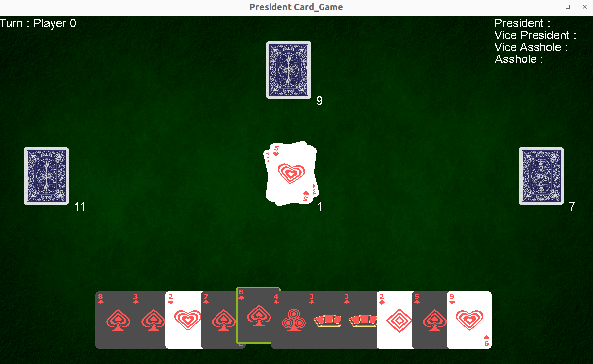

# President_Card_Game

The goal was to implement a game of incomplete information to apply the mcts algorithm.  
We chose President(Asshole) Card game.

## Features

- [x] Play through SDL interface
- [ ] MCTS algorithm

## Our Implementation
### Demo

### How to play ?

- `make` and then `./main`
- Switch cards in your hand with right click
- Select cards to play with left click
- Play (Cards you selected, if not you pass) by pressing space  
[Rules Source](https://www.wikihow.com/Play-President-(Card-Game))

### Image

